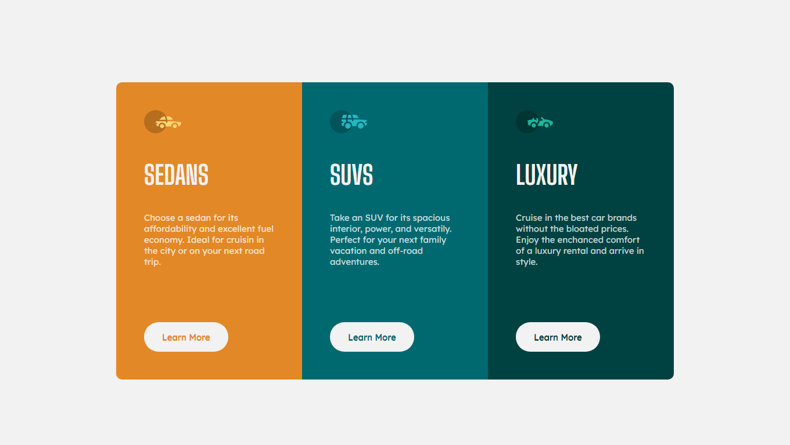

# columns-preview-card-component-main solution from Frontend Mentor Challenges

This is a solution to the [3-column preview card component challenge on Frontend Mentor](https://www.frontendmentor.io/challenges/3column-preview-card-component-pH92eAR2-). Frontend Mentor challenges help you improve your coding skills by building realistic projects. 

## Overview

### The challenge

This is a great small challenge to help get you used to building to a design. There's no JS in this project, so you'll be able to focus on your HTML & CSS skills.

### Screenshot

## My process

### Built with

- Semantic HTML5 markup
- CSS custom properties
- Flexbox
- CSS Grid

## Author

- Website - [valentinacmp](https://github.com/valentinacmp)
- Frontend Mentor - [@valenmp](https://www.frontendmentor.io/profile/valenmp)
